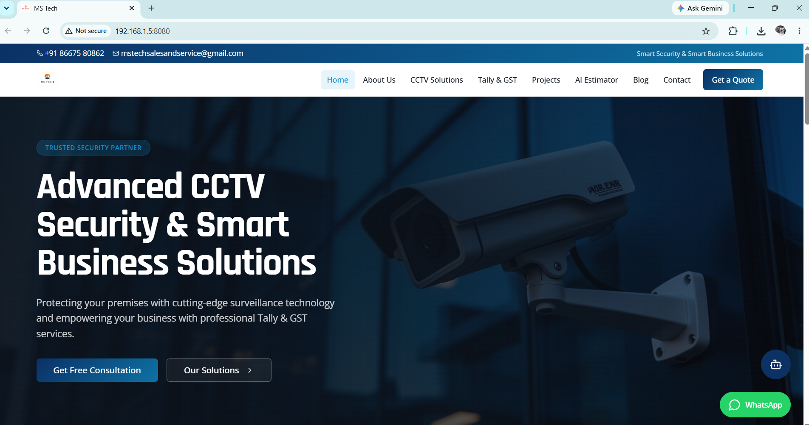
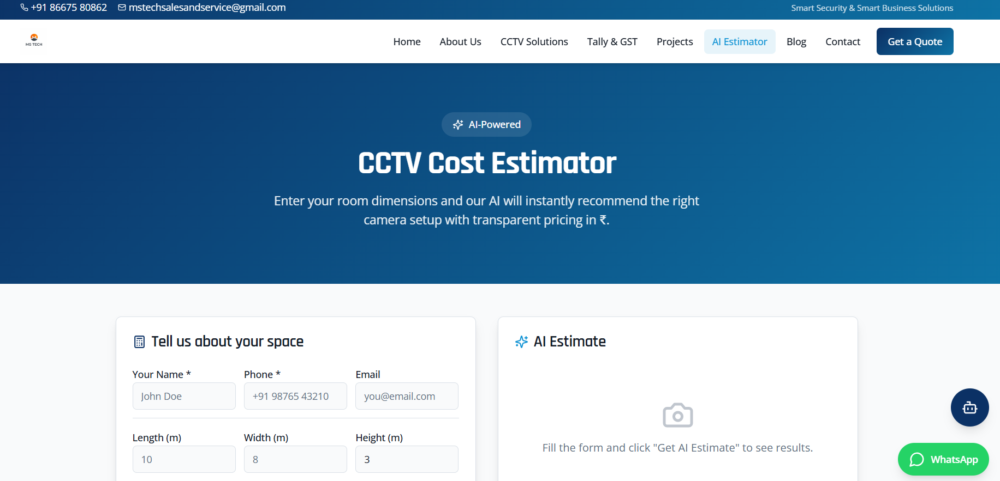
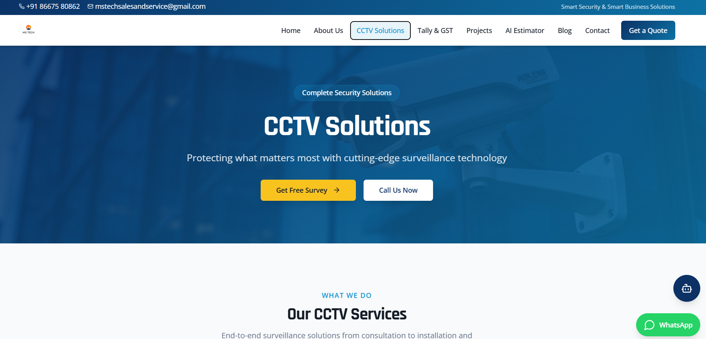

MS Tech – Smart CCTV & Tally Service Management Platform

📌 Project Overview

MS Tech is a modern web-based platform designed to provide professional CCTV Surveillance Solutions and Tally Accounting Services. The application enables customers to explore services, estimate CCTV installation costs using AI-driven calculations, view project portfolios, and contact service providers seamlessly.

The platform combines intelligent estimation, customer engagement tools, and service management features to improve business efficiency and customer satisfaction.

🚀 Key Features
📹 CCTV Services
CCTV Camera Installation
DVR/NVR Configuration
Network Cabling Solutions
Surveillance System Consultation
Maintenance & Support Services
Remote Monitoring Setup
💼 Tally & GST Services
Tally Prime Installation
GST Billing Configuration
Accounting Setup
Tally Customization
User Training
Technical Support
🤖 AI CCTV Cost Estimator
Area-based camera requirement prediction
Equipment recommendation
Cabling estimation
Installation cost calculation
Budget forecasting
Customized security recommendations
💬 Customer Interaction
AI Chatbot Assistance
WhatsApp Integration
Contact Forms
Service Inquiry Management
📊 Administration Module
Admin Dashboard
Customer Request Tracking
Estimate Management
Service Monitoring
🏗️ System Architecture
MS Tech Platform
│
├── Frontend (React + TypeScript)
│   ├── Home Page
│   ├── Services
│   ├── AI Estimator
│   ├── Projects
│   ├── Blog
│   ├── Contact
│   └── Admin Panel
│
├── Backend (Supabase)
│   ├── Database
│   ├── Authentication
│   └── Storage
│
└── Integrations
    ├── WhatsApp Support
    ├── AI Chatbot
    └── Customer Inquiry System
🛠️ Technology Stack
Frontend
React.js
TypeScript
Vite
UI Framework
Tailwind CSS
ShadCN UI
Radix UI
Backend
Supabase
State Management
TanStack React Query
Form Handling
React Hook Form
Zod Validation
Routing
React Router DOM
Additional Libraries
Lucide React
Sonner Notifications
Recharts
📂 Project Structure
src/
│
├── assets/
│
├── components/
│   ├── Navbar
│   ├── Footer
│   ├── ChatBot
│   ├── WhatsAppButton
│   ├── ServiceCard
│   └── UI Components
│
├── pages/
│   ├── Home
│   ├── About
│   ├── CCTVSolutions
│   ├── TallyServices
│   ├── Projects
│   ├── AIEstimator
│   ├── Blog
│   ├── Contact
│   └── Admin
│
├── hooks/
├── integrations/
│   └── Supabase
│
├── App.tsx
└── main.tsx
⚙️ Installation Guide
Clone Repository
git clone https://github.com/AarthySwetha/MS-Tech.git
Navigate to Project Directory
cd ms-tech
Install Dependencies
npm install
Start Development Server
npm run dev
Build Production Version
npm run build
Preview Production Build
npm run preview
🔐 Environment Variables

Create a .env file in the root directory.

VITE_SUPABASE_URL=your_supabase_url
VITE_SUPABASE_ANON_KEY=your_supabase_anon_key
🤖 AI CCTV Estimator Workflow
Input Parameters
Customer Name
Contact Information
Property Type
Building Dimensions
Security Requirements
Processing
Area Calculation
Camera Count Prediction
Equipment Selection
Installation Cost Calculation
Output
Recommended CCTV Setup
Estimated Equipment Cost
Installation Charges
Total Budget Estimate
🎯 Objectives
Digitize CCTV and Tally service management.
Provide accurate CCTV cost estimation.
Enhance customer interaction through AI tools.
Streamline quotation and inquiry handling.
Improve business visibility through a modern web platform.
📈 Future Enhancements
Machine Learning-based Camera Placement
Online Appointment Booking
Payment Gateway Integration
Customer Dashboard
Real-time Project Tracking
Multi-language Support
Predictive Security Analysis
📸 Screenshots
Home Page

AI Estimator

Services Page

🧪 Testing

Run the application tests:

npm test
👨‍💻 Developed By

Aarthy Swetha M

Full Stack Web Application Project

📄 License

This project is licensed under the MIT License.

⭐ If you found this project useful, consider giving it a star on GitHub.